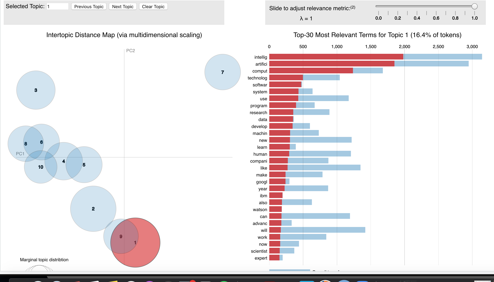

```{r,echo=FALSE, message=FALSE, warning=FALSE}
library(tidyverse)
library(readr)
library(tidytext)
library(wordcloud2)
library(forcats)
library(dplyr)
library(readtext) 
library(ggplot2)
library(SnowballC)
library(topicmodels)
library(stm)
library(ldatuning)
library(knitr)
library(LDAvis)
library(stringr)
library(servr)
library(scales)
library(reshape2)

robot_ai_all_public <- read_csv("data/robot-ai-all-public.csv")

ai_public <- robot_ai_all_public %>%
  select("Article ID", "Article Date", "Paragraph number","NYT section",Paragraph, Title, "AI Mood")

ai_public_new <- ai_public %>%
  rename(
    ID = "Article ID",
    Date = "Article Date",
    Paragraph_number= "Paragraph number",
    Section= "NYT section",
    AI_mood= "AI Mood"
  )

ai_duplicated<- distinct(ai_public_new,ID,Date,Paragraph_number,Section,Paragraph, Title)

ai_public_removed <- ai_duplicated

ai_words <- ai_public_removed %>%
  unnest_tokens(word, Paragraph) %>%
  count(Title, word, sort = TRUE)

total_words <- ai_words %>%
  group_by(Title) %>%
  summarise(total = sum(n))

ai_totals <- left_join(ai_words, total_words)

ai_tf_idf <- ai_totals %>%
  bind_tf_idf(word, Title, n)

ai_public_tidy <- ai_public_removed %>%
  na.omit() %>%
  unnest_tokens(output = word, input = Paragraph) %>%
  anti_join(stop_words, by = "word")

ai_counts <- ai_public_tidy %>%
  filter(word != "tri") %>%
  filter(word != "im") %>%
  filter(word != "ms") %>%
  filter(word !="ii") %>%
  count(word, sort = TRUE) 

ai_clean <- anti_join(ai_counts, stop_words)


ai_dtm <- ai_public_tidy %>%
  count(Section, word) %>%
  cast_dtm(Section, word, n)

temp <- textProcessor(ai_public_removed$Paragraph, 
                      metadata = ai_public_removed,  
                      lowercase=TRUE, 
                      removestopwords=TRUE, 
                      removenumbers=TRUE,  
                      removepunctuation=TRUE, 
                      wordLengths=c(3,Inf),
                      stem=TRUE,
                      onlycharacter= FALSE, 
                      striphtml=TRUE, 
                      customstopwords=NULL
                      )
meta <- temp$meta
vocab <- temp$vocab
docs <- temp$documents

stemmed_ai <- ai_public_removed %>%
  unnest_tokens(output = word, input = Paragraph) %>%
  anti_join(stop_words, by = "word") %>%
  mutate(stem = wordStem(word))

stemmed_ai <- ai_public_removed %>%
  unnest_tokens(output = word, input = Paragraph) %>%
  anti_join(stop_words, by = "word") %>%
  mutate(stem = wordStem(word)) %>%
  count(ID, stem) %>%
  cast_dtm(ID,stem,n)

stemmed_dtm_ai <- ai_public_removed  %>%
  unnest_tokens(output = word, input = Paragraph) %>%
  anti_join(stop_words, by = "word") %>%
  mutate(stem = wordStem(word)) %>%
  count(word, stem, sort = TRUE) %>%
  cast_dtm(word, stem, n)
```

## Introduction

**Purpose:** The purpose of this project is to explore the trends related to Artificial Intelligence in the New York Times newspaper from 1986 to 2016.The media plays a powerful role to control the public perceptions.Understanding of the media's attitude toward AI can help to understand people's perspectives likewise.

**Data Sources:** As data source, this project used the Fast & Horvitz (2016) AI news annotated dataset. This dataset includes the AI article information in the New York Times. You can find the overview of the dataset below.

**Target Audience:** This analysis may help AI educators and researchers who want to develop educational learning activities related to text mining classification task. They can use this analysis as an example to reveal possible learning opportunities.

```{r,echo=FALSE, message=FALSE, warning=FALSE}
glimpse(ai_public_new)
```

## Preparing the Data

Before starting the analysis, I cleaned the data. The paragraphs were annotated by three different person, therefore they were repeated three times. For this reason, I have created a data frame and remove the dublicated paragraphs.

```{r,echo=TRUE, message=FALSE, warning=FALSE}
ai_duplicated<- distinct(ai_public_new,ID,Date,Paragraph_number,Section,Paragraph, Title)
glimpse(ai_duplicated)
```

## Methods

1.  Visualize Data: Basic word counts, bar graphs frequencies

2.  Topic modeling using LDA

3.  Topic modeling using STM

4.  Sentiment analysis

5.  Reading the Tea Leaves

## Visualize Data: Basic word counts, bar graphs frequencies

###Term Frequency-Inverse Document Frequency

```{r,echo=FALSE, message=FALSE, warning=FALSE}
total_words
head(ai_tf_idf)
```

### WordCloud

```{r,echo=FALSE, message=FALSE, warning=FALSE}

wordcloud2(ai_clean)

```

### Bar Chart

```{r,echo=FALSE, message=FALSE, warning=FALSE}
ai_clean %>%
  filter(n > 200) %>% 
  mutate(word = reorder(word, n)) %>% 
  ggplot(aes(n, word)) + 
  geom_col() 
```

### Frequencies

```{r,echo=FALSE, message=FALSE, warning=FALSE}

ai_frequencies <- ai_public_tidy %>%
  count(Section,Title, word, sort = TRUE) %>%
  mutate(proportion = n / sum(n))

ai_frequencies %>%
  slice_max(proportion, n = 10) %>%
  ungroup() %>%
  group_by(Section) %>%
  ggplot(aes(proportion, fct_reorder(word, proportion), fill = Title)) +
  geom_col(show.legend = FALSE) +
  facet_wrap(~Title, ncol = 2, scales = "free") +
  labs(y = NULL, x = NULL)

```

### Showing in Multiple Graphs

```{r,echo=FALSE, message=FALSE, warning=FALSE}

ai_title_counts <- ai_public_tidy %>%
  count(Title, word)

total_words <- ai_title_counts %>%
  group_by(Title) %>%
  summarize(total = sum(n))

ai_words <- left_join(ai_title_counts, total_words)

ai_tf_idf <- ai_words %>%
  bind_tf_idf(word, Title, n)

ai_tf_idf %>%
  filter(tf_idf >= "2.0") %>%
  group_by(Title) %>%
  slice_max(tf_idf, n = 5) %>%
  ungroup() %>%
  mutate(Title=as.factor(Title),
         word=reorder_within(word, tf_idf, Title)) %>%
  ggplot(aes(word, tf_idf, fill = Title)) +
  geom_col(show.legend = FALSE) +
  facet_wrap(~Title, ncol = 2, scales = "free") +
  coord_flip() +
  scale_x_reordered() +
  labs(title = "Words Unique to Each Article", x = "tf-idf value", y = NULL)

```

## Topic Modeling with LDA

Before LDA model, I kept wrangling process by stemming tidy text.

```{r,echo=TRUE, message=FALSE, warning=FALSE}
stemmed_ai

stemmed_dtm_ai

```

Let's find the number of title with distinct function.

```{r,echo=TRUE, message=FALSE, warning=FALSE}

n_distinct(ai_public_removed$Title)

```

Since it looks like there are 3200 distinct discussion forums, we'll use that as our value for the k = argument of the LDA(). However, my computer is not able to perform a large number of iterations. Therefore, I chose to conduct 20 iterations.

```{r,echo=TRUE, message=FALSE, warning=FALSE}
ai_lda<- LDA(ai_dtm, 
              k = 20, 
              control = list(seed = 588)
)

ai_lda
```

## Topic Modeling with STM

```{r}
docs <- temp$documents
meta <- temp$meta
vocab <- temp$vocab

ai_stm <- stm(documents=docs,
                          data=meta,
                          vocab=vocab,
                          K=10,
                          max.em.its=25,
                          verbose = FALSE)

plot.STM(ai_stm, n = 5)
```

### Finding K

```{r,echo=FALSE, message=FALSE, warning=FALSE}

k_metrics_ai <- FindTopicsNumber(
  ai_dtm,
  topics = seq(10, 75, by = 5),
  metrics = "Griffiths2004",
  method = "Gibbs",
  control = list(),
  mc.cores = NA,
  return_models = FALSE,
  verbose = FALSE,
  libpath = NULL
)

FindTopicsNumber_plot(k_metrics_ai)

```

###The LDAvis Explorer

{width="600"}

## Sentiment Analysis Using Bing
```{r,echo=FALSE, message=FALSE, warning=FALSE}
bing <- get_sentiments("bing")

sentiment_bing <- inner_join(ai_public_tidy, bing, by = "word")


summary_bing <- sentiment_bing %>% 
  group_by(Section) %>% 
  count(sentiment, sort = TRUE) %>% 
  spread(sentiment, n) %>%
  mutate(sentiment = positive - negative) %>%
  mutate(lexicon = "bing") %>%
  relocate(lexicon)

summary_bing

summary_bing_word <- sentiment_bing %>% 
  group_by(word) %>% 
  count(sentiment, sort = TRUE) %>% 
  spread(sentiment, n) %>%
  mutate(sentiment = positive - negative) %>%
  mutate(lexicon = "bing") %>%
  relocate(lexicon)

summary_bing_word

bing_counts <- sentiment_bing %>%
  count(sentiment, sort = TRUE)

bing_counts %>%
  mutate(sentiment = reorder(sentiment,n)) %>%
  ggplot(aes(n, sentiment)) +
  geom_col() +
  labs(x = "Bing Sentiment", y = NULL) +
  theme_minimal()
```


## Key Insight

My analysis revealed that Artificial Intelligence related articles were mostly considered the technological developments in robots. Additionally, the latest articles were leaning toward positive thoughts about AI when we examined the earlier articles between 1986 and 2016.

## Actions
Since most upcoming word in the articles is "Robot", the instructional designers and/or AI researchers think about the start AI discussions with the robotics development in AI field. Students might be more familiar with these developments, so the researchers can attract their attention to the field from this perspective.

## Limitations
This dataset includes the articles until 2016, so it does not provide information about the current trends. 

